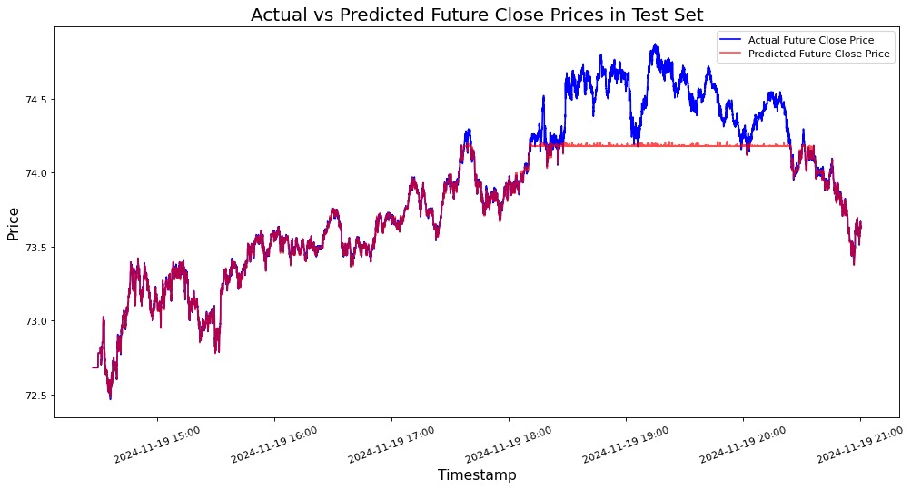
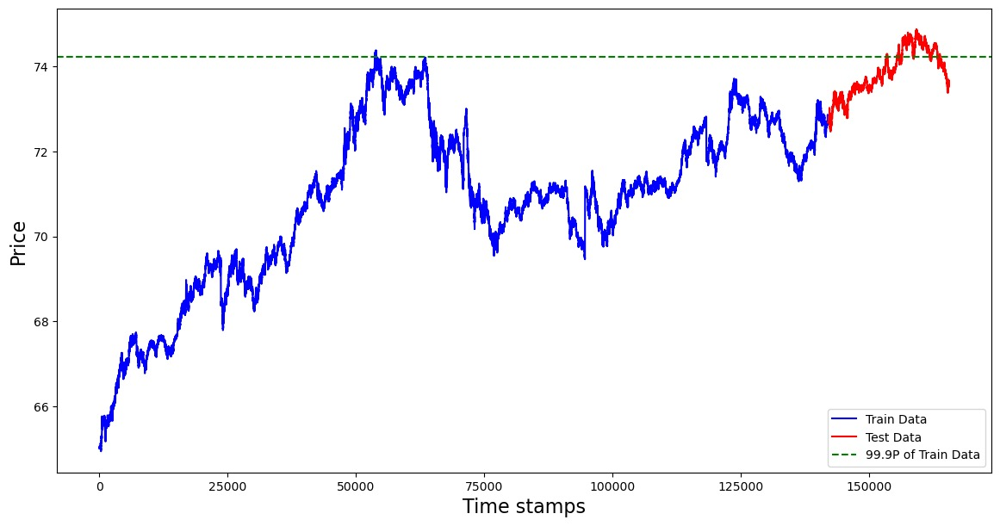
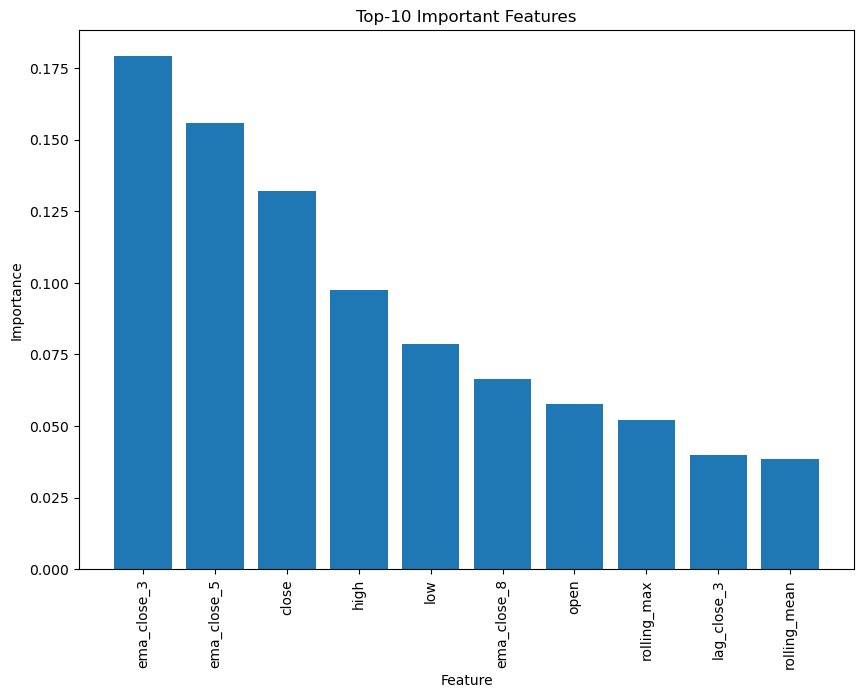

# Algorithm Trading Strategies

A comprehensive algorithmic trading system for cryptocurrency markets using XGBoost machine learning models, integrated with Strategy Studio for backtesting and performance analysis.

## Team

**Nhi Dinh (Team Leader)**
- Sophomore majoring in Statistics and Computer Science with Mathematics minor at University of Illinois Urbana-Champaign
- Email: nhidinh2@illinois.edu

**Jun Sang**
- Second-year master's student in Mechanical Engineering at University of Illinois at Urbana-Champaign
- Email: junsang5@illinois.edu

**Kejie Zhao**
- First-year PhD student in Informatics with research focus on applied deep learning in geoscience, remote sensing and environmental science
- Email: kejiez2@illinois.edu

**Krish**
- Junior double majoring in Computer Engineering and Statistics at University of Illinois at Urbana-Champaign
- Email: krishkg2@illinois.edu (School) | kjg2352@gmail.com (Work)

## Project Summary

This project develops and implements an end-to-end algorithmic trading system for cryptocurrency markets, specifically focusing on GBTC (Grayscale Bitcoin Trust). The system integrates machine learning-based price prediction with automated trading strategies, backtesting infrastructure, and comprehensive performance analytics.

### Key Accomplishments

1. **Data Pipeline**: Built a complete data collection and preprocessing pipeline using IEX market data, parsing depth-of-book data and converting it into ML-ready features.

2. **Machine Learning Model**: Developed an XGBoost-based price prediction model achieving:
   - **R² Score: 0.86** (explains 86% of price variability)
   - **MSE: 0.043**
   - Training time: ~162 seconds on M1 Pro MacBook Pro
   - Inference time: 0.03 seconds per prediction

3. **Feature Engineering**: Created 25+ engineered features including:
   - OHLC prices and order book metrics
   - Rolling statistics (mean, std, min, max) over 20-step windows
   - Exponential Moving Averages (3, 5, 8 step spans)
   - Technical indicators (RSI, MACD)
   - Lagged price features (1-3 steps)
   - Order book imbalance and spread metrics

4. **Strategy Implementation**: Integrated the ML model with Strategy Studio using XGBoost's C API, enabling real-time trading decisions in C++.

5. **Backtesting Infrastructure**: Set up automated backtesting pipeline using Jenkins, Strategy Studio, and Ubuntu VM for strategy validation.

6. **Performance Analysis**: Developed visualization tools to analyze trading performance, including:
   - Cumulative PnL tracking
   - Sharpe ratio calculation
   - Maximum drawdown analysis
   - Price movement comparisons

## Project Architecture

### 1. Data Collection & Preprocessing

We adapted Professor Lariviere's IEX data downloader/parser to collect depth-of-book market data. The pipeline:

- Downloads IEX market data (DEEP and TRADE feeds) for specified date ranges
- Parses compressed PCAP files into structured CSV format
- Processes order book updates into candlestick data with 0.5-second intervals
- Generates both training data (`book_updates.csv`) and Strategy Studio-compatible tick data

**Usage**:
```bash
# Download data
python3 src/download_iex_pcaps.py --start-date 2024-11-12 --end-date 2024-11-17 --download-dir data/iex_downloads

# Parse data (recommended: 6 days for training, 7th day for testing)
./parse_all.sh  # Edit --symbols argument for different tickers (default: GBTC)
```

### 2. Machine Learning Model

**Model**: XGBoost Regressor for price prediction

**Training Process**:
- 6 days of data for training, 7th day for testing
- Randomized hyperparameter search with 5-fold cross-validation
- Features: 25 engineered features from order book data
- Target: Future close price (2-step ahead, ~1 second horizon)

**Performance Metrics**:
- Mean Squared Error: 0.043
- R² Score: 0.86
- Training time: ~162 seconds
- Inference: 0.03 seconds per prediction

**Key Features**:
- Current OHLC prices
- Rolling statistics (20-step window): mean, std, min, max of close prices, spreads, and order book imbalance
- Exponential Moving Averages: 3, 5, and 8-step spans
- Lagged features: Close prices from 1-3 steps prior
- Technical indicators: RSI (20-step), MACD (5-10 step EMAs)

**Model Insights**:
- Shorter-span EMAs (3-5 steps) were most predictive
- Model struggles with prices exceeding historical maximums (requires regular retraining)
- Feature correlation analysis was performed to eliminate redundancy

**Usage**:
```bash
# Train model
# Run Crypto_Pred_XGBoost.ipynb with 6-day training data
# Model saved to models/best_xgb_model.json

# Generate predictions
python models/model.py  # For inference on new data
```

### 3. Strategy Implementation

**Integration**: XGBoost C API integration with Strategy Studio C++ framework

**Components**:
- `XGBoost/XGBoost.cpp` & `XGBoost/XGBoost.hpp`: XGBoost wrapper for C++
- `strategy/strategy.cpp` & `strategy/strategy.h`: Trading strategy implementation
- Model loaded from JSON format for portability
- Real-time predictions integrated into trading logic

**Backtesting Infrastructure**:
- Jenkins pipeline for automated backtesting
- Strategy Studio on Ubuntu 20.04 VM
- Automated compilation and execution via Makefiles and shell scripts

**Note**: Some integration bugs remain in the current implementation, requiring further debugging.

### 4. Performance Analysis & Visualization

Comprehensive analysis tools for evaluating trading strategy performance:

**Metrics Calculated**:
- Cumulative PnL
- Sharpe Ratio
- Maximum Drawdown
- Cumulative Returns

**Visualizations**:
- PnL over time charts
- Price movement comparisons
- Metrics summary tables

**Usage**:
```bash
# Run visualization notebook
jupyter notebook visualization/backtesting_visualization.ipynb
# Output saved to visualization/output_charts/
```

## Repository Structure

```
.
├── README.md
├── Jenkinsfile                    # CI/CD pipeline configuration
├── models/                        # Machine learning models
│   ├── Crypto_Pred_XGBoost.ipynb # Main training notebook
│   ├── model.py                   # Inference script
│   └── best_xgb_model.json       # Trained XGBoost model
├── iexdownloaderparser-main/     # IEX data downloader/parser (adapted)
│   ├── src/                       # Parser source code
│   ├── download.sh                # Download script
│   └── parse_all.sh              # Parsing script
├── XGBoost/                       # XGBoost C++ integration
│   ├── XGBoost.cpp               # C++ wrapper implementation
│   ├── XGBoost.hpp               # C++ wrapper header
│   ├── Makefile                  # Build configuration
│   └── compile_and_backtest.sh   # Build and test script
├── strategy/                      # Trading strategy implementation
│   ├── strategy.cpp              # Strategy logic
│   ├── strategy.h                # Strategy header
│   ├── Makefile                  # Build configuration
│   └── go.sh                     # Execution script
├── visualization/                 # Performance analysis
│   ├── backtesting_visualization.ipynb  # Analysis notebook
│   ├── data/                     # Backtesting results
│   └── output_charts/            # Generated visualizations
├── pictures/                      # Model performance visualizations
│   ├── price_prediction.jpg      # Prediction vs actual comparison
│   ├── feature_importance.jpg    # Feature importance analysis
│   └── error_investigation.jpg   # Error analysis
└── data/                          # Market data (example files)
    └── 20241112_book_updates.csv
```

## Results & Findings

### Model Performance
- **Strong predictive power**: R² of 0.86 indicates the model captures most price variability
- **Fast inference**: 0.03 seconds per prediction enables real-time trading
- **Limitations**: Performance degrades at price levels exceeding historical training data ranges



### Error Analysis: Predictions Above $74

A detailed investigation of the model's performance reveals an important limitation: the model struggles significantly when predicting prices above $74. This behavior is consistent with a fundamental principle in machine learning—models cannot accurately predict values outside their training distribution.

**Key Findings:**
- The model demonstrates excellent predictive accuracy for prices within the range it was trained on
- Prediction errors increase dramatically when test prices exceed the 99.95th percentile of training data prices
- Prices above $74 represent price levels that the model had never encountered during training

**Why This Happens:**
Any advanced ML model cannot predict values it has never seen during training. When prices exceed approximately $74 (near the historical maximum observed in the training data), the model lacks the necessary patterns and relationships to make accurate predictions at these price levels.

**Implications:**
This finding underscores the importance of:
1. **Regular model retraining**: The model needs periodic updates as new market data becomes available to adapt to changing price ranges
2. **Training data coverage**: Ensuring training data covers a wide range of market conditions, including extreme price movements
3. **Model monitoring**: Continuously monitoring prediction errors to identify when retraining is necessary

The advantage of our approach is that model retraining is relatively fast (~162 seconds), making it feasible to update the model regularly as market conditions evolve.



### Feature Importance
The most predictive features were:
1. Short-span exponential moving averages (3-5 steps)
2. Current OHLC prices
3. Rolling statistics (mean, max)
4. Lagged close prices



### Technical Challenges
- Integration between Python ML models and C++ trading platform
- Handling high-frequency market data volumes
- Model retraining requirements for regime changes
- Strategy Studio integration complexity

## Future Improvements

### Model Enhancements
- Expand training dataset (e.g., one month of data)
- Train separate models for different assets
- Implement automated retraining triggers
- Explore additional order book features

### Strategy Development
- Fix current Strategy Studio integration bugs
- Implement more sophisticated risk management
- Add position sizing based on model confidence
- Support multiple cryptocurrency pairs

### Infrastructure
- Improve Jenkins pipeline modularity
- Add real-time data streaming capabilities
- Implement more robust error handling
- Create comprehensive testing framework

## Conclusion & Team Reflections

### What We Learned

- **Data Engineering**: Managing large-scale market data requires careful consideration of storage and computational resources
- **Feature Engineering**: Creating meaningful features is often more critical than model selection for financial time series
- **Integration Complexity**: Bridging Python ML models with C++ trading systems presents significant technical challenges
- **System Architecture**: Building end-to-end trading systems requires expertise across data science, software engineering, and financial markets

### Individual Contributions

**Nhi Dinh**: IEX parser adaptation, XGBoost C API installation and configuration with Strategy Studio integration, model implementation and fixes, visualization development and project documentation

**Kejie Zhao**: Model selection, feature engineering, training and evaluation, feature importance analysis

**Jun Sang**: Data collection and preprocessing, data pipeline development, integration exploration (Pybind)

**Krish**: Strategy Studio integration, Jenkins pipeline development, XGBoost C API integration, debugging and system configuration

## References

1. Hochreiter, S., & Schmidhuber, J. (1997). Long Short-Term Memory. Neural Computation, 9(8), 1735-1780.
2. Chen, T., & Guestrin, C. (2016). XGBoost: A Scalable Tree Boosting System. KDD '16.
3. Various XGBoost documentation and Strategy Studio documentation

---

**Note**: This project was developed as part of a course at the University of Illinois at Urbana-Champaign. Some components (particularly Strategy Studio integration) require proprietary software access and may have unresolved bugs.
